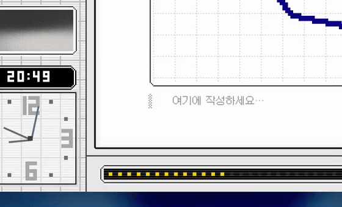
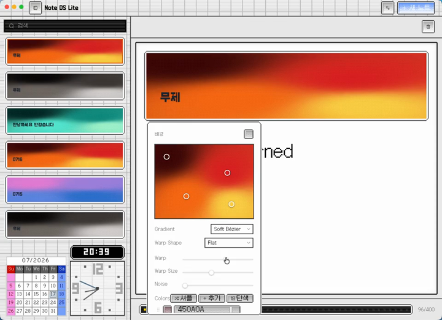
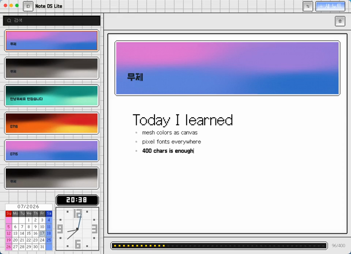
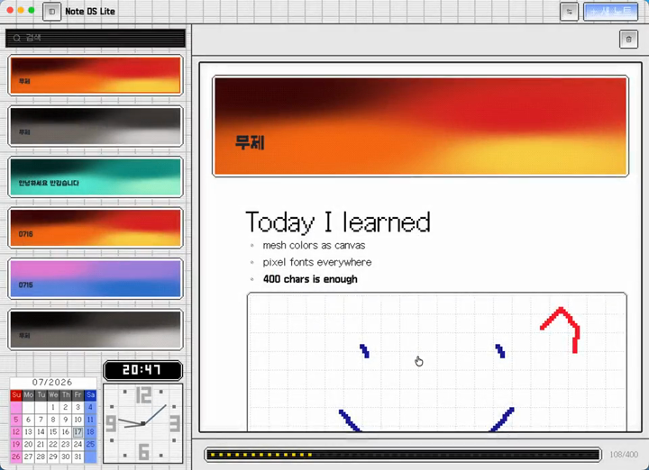

# Note DS Lite

단축키 한 번으로 화면 위에 뜨는 **400자 퀵 노트**. 메모 앱을 여는 몇 초 사이에 생각이 사라지는 게 싫어서 만들었습니다.

노트는 앱 안에 갇히지 않고 **마크다운 파일**로 저장되며, 화면은 닌텐도 DS 픽토챗을 닮았습니다.

  

  <a href="https://ta09472.github.io/note-ds-lite-public/"><b>소개 페이지</b></a> ·
  <a href="https://github.com/ta09472/note-ds-lite-public/releases/latest"><b>최신 버전 받기</b></a>

## 다운로드

| 플랫폼 | 파일 |
| --- | --- |
| macOS (Apple Silicon) | `Note DS Lite-x.y.z-arm64.dmg` |
| macOS (Intel) | `Note DS Lite-x.y.z.dmg` |
| Windows | `Note DS Lite Setup x.y.z.exe` |
| Linux (x64) | `Note DS Lite-x.y.z.AppImage` |
| Linux (arm64) | `Note DS Lite-x.y.z-arm64.AppImage` |

→ [Releases에서 받기](https://github.com/ta09472/note-ds-lite-public/releases/latest)

> **macOS 첫 실행 안내** — 코드 서명을 하지 않아 Gatekeeper가 실행을 막습니다. 앱을 **우클릭 → 열기**로 한 번만 실행하면 이후에는 평소처럼 열립니다.
> **Windows** — SmartScreen 경고가 뜨면 `추가 정보 → 실행`을 눌러주세요.
> **Linux** — 다운로드한 `.AppImage`에 실행 권한을 주고 실행합니다: `chmod +x *.AppImage && ./Note*.AppImage`

## 이렇게 씁니다

| | |
| --- | --- |
| **퀵 노트** | `⌘⇧N` (Windows·Linux는 `Ctrl+Shift+N`, macOS는 `⌥` 더블탭도 가능)으로 어디서든 호출 → `⌘↩` 저장 · `esc` 닫기 |
| **400자 제한** | 도트 게이지가 차오릅니다. 길게 쓸 일이 없으니 가볍게 열고 닫게 됩니다 |
| **마크다운** | 슬래시 메뉴로 제목·목록·표·코드·이미지까지. 퀵 노트지만 에디터는 진심입니다 |
| **카드 배경** | 메쉬 그라디언트를 셔플하거나 직접 점을 끌어 노트마다 다른 표정을 줍니다 |
| **픽셀 드로잉** | 펜으로 쓱쓱 그린 낙서를 본문에 그대로 얹습니다 |
| **내 파일로 보관** | 노트는 `.md` 파일. 저장 폴더를 원하는 곳(iCloud, Dropbox 등)으로 바꿀 수 있습니다 |
| **4개 언어** | 한국어 · English · 日本語 · 中文 |

  
  
  

## 업데이트

앱의 **설정 → 업데이트 → 업데이트 확인**을 누르면 이 저장소의 최신 릴리스와 현재 버전을 비교합니다. 새 버전이 있으면 받기 버튼이 나타납니다.

## 저장소 안내

이 저장소는 **배포용**입니다 — 소개 페이지와 설치파일만 있습니다. 앱 소스코드는 비공개로 관리하고 있습니다.

버그 제보나 기능 제안은 [Issues](https://github.com/ta09472/note-ds-lite-public/issues)에 남겨주세요.

## 만든 것들

픽셀 프레임·버튼·팔레트는 [ds.css](https://github.com/spiritov/ds.css), 글꼴은 [Galmuri](https://github.com/quiple/galmuri)를 사용했습니다.
그 외 [Electron](https://www.electronjs.org) · [React](https://react.dev) · [TypeScript](https://www.typescriptlang.org) · [Milkdown](https://milkdown.dev) · [Tailwind CSS](https://tailwindcss.com) · [Motion](https://motion.dev)

---

© 2026 beomsu
